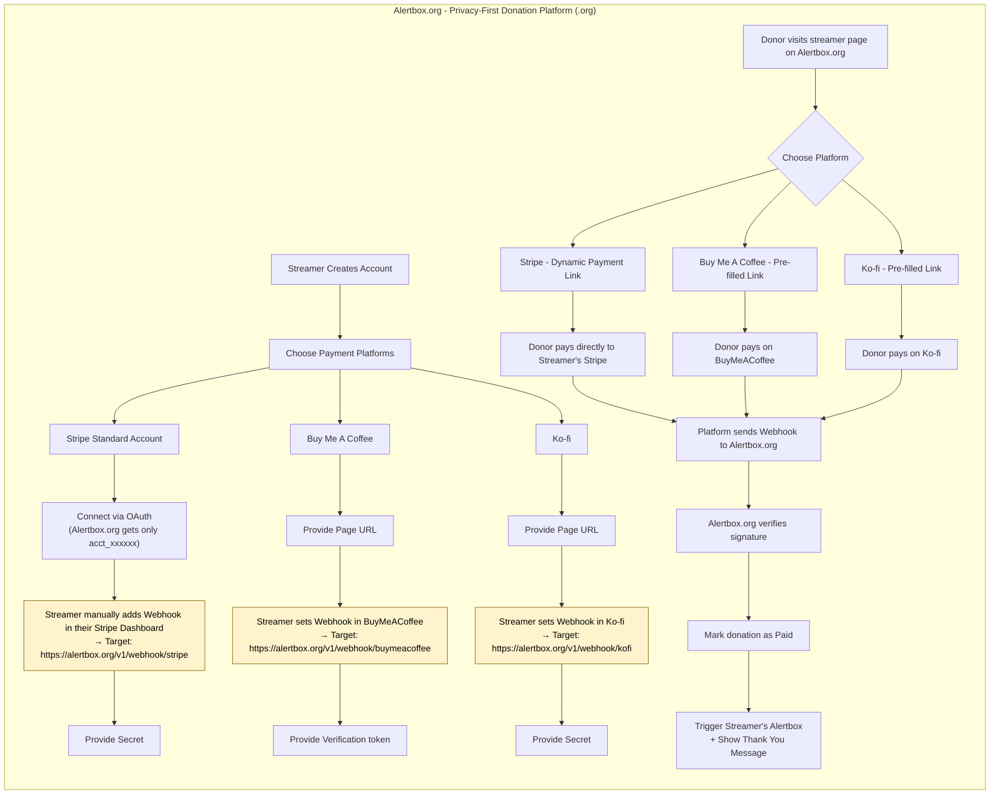

# Alertbox.org - Donation System Architecture

## Overview

A **privacy-first, multi-platform** donation + alert system for streamers (.org project)

```mermaid
flowchart TD
    subgraph "Alertbox.org - Privacy-First Donation Platform (.org)"
        direction TB

        A[Streamer Creates Account]
        --> B[Choose Payment Platforms]

        B --> C1[Stripe Standard Account]
        B --> C2[Buy Me A Coffee]
        B --> C3[Ko-fi]

        %% Stripe Flow
        C1 --> D1["Connect via OAuth\n(Alertbox.org gets only acct_xxxxxx)"]
        D1 --> E1["Streamer manually adds Webhook in their Stripe Dashboard\n→ Target: https://alertbox.org/v1/webhook/stripe"]
        E1 --> F1["Provide Secret"]

        %% BMC & Ko-fi
        C2 --> D2["Provide Page URL"]
        D2 --> E2["Streamer sets Webhook in BuyMeACoffee\n→ Target: https://alertbox.org/v1/webhook/buymeacoffee"]
        E2 --> F2["Provide Verification token"]

        C3 --> D3["Provide Page URL"]
        D3 --> E3["Streamer sets Webhook in Ko-fi\n→ Target: https://alertbox.org/v1/webhook/kofi"]
        E3 --> F3["Provide Secret"]

        %% Donor Flow
        F[Donor visits streamer page on Alertbox.org]
        --> G{Choose Platform}

        G --> H1[Stripe - Dynamic Payment Link]
        G --> H2[Buy Me A Coffee - Pre-filled Link]
        G --> H3[Ko-fi - Pre-filled Link]

        H1 --> I1[Donor pays directly to Streamer's Stripe]
        H2 --> I2[Donor pays on BuyMeACoffee]
        H3 --> I3[Donor pays on Ko-fi]

        %% Webhook & Alert
        I1 --> J[Platform sends Webhook to Alertbox.org]
        I2 --> J
        I3 --> J

        J --> K[Alertbox.org verifies signature]
        K --> L[Mark donation as Paid]
        L --> M[Trigger Streamer's Alertbox\n+ Show Thank You Message]

        style E1 fill:#fff3cd,stroke:#856404
        style E2 fill:#fff3cd,stroke:#856404
        style E3 fill:#fff3cd,stroke:#856404
    end

    classDef yellow fill:#fff3cd,stroke:#856404,color:#000
    class E1,E2,E3 yellow
```
