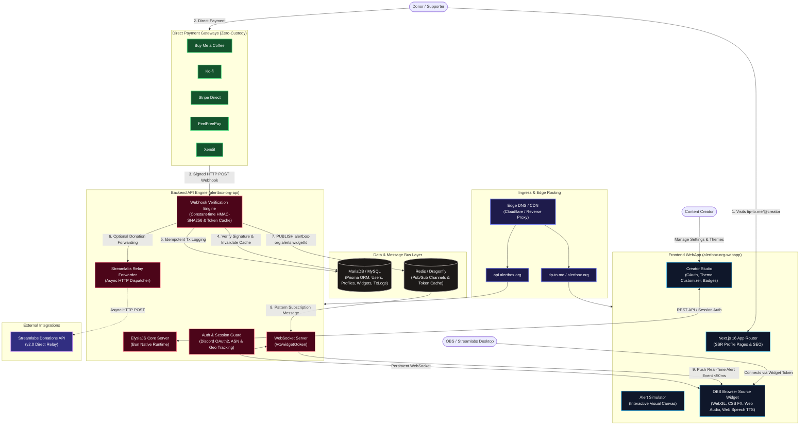
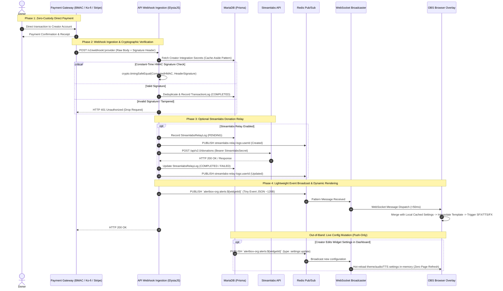

# Alertbox.org

<div align="center">
  <p><strong>Open-source, privacy-first livestream tipping overlay and creator monetization platform.</strong></p>
  <p>
    <a href="https://alertbox.org">Website</a> •
    <a href="https://tip-to.me">TipTo.Me</a> •
    <a href="https://github.com/Ponlponl123-Labs/alertbox-org-webapp">Frontend</a> •
    <a href="https://github.com/Ponlponl123-Labs/alertbox-org-api">Backend API</a>
  </p>
</div>

---

## 1. System Architecture & Topology

Alertbox operates on a **zero-custody, real-time fan-out** architecture. Tips flow directly to creator payment gateways, while webhook signals are validated in constant time and broadcasted over WebSockets to OBS in <50ms.



---

## 2. End-to-End Real-Time Event Pipeline



---

## 3. Security, Privacy & Reliability Matrix

```mermaid
flowchart LR
    subgraph ZeroCustody["Zero-Custody Guarantee"]
        direction TB
        ZC1["100% Direct Payouts"]
        ZC2["No Intermediary Wallet"]
        ZC3["No Fund Holding Accounts"]
    end

    subgraph Cryptography["Cryptographic Security"]
        direction TB
        CS1["Constant-Time HMAC-SHA256 Verification"]
        CS2["Replay Attack Prevention via Unique Tx ID"]
        CS3["Timing-Safe Equality Checks"]
    end

    subgraph Privacy["Streamer Privacy & Access Control"]
        direction TB
        PR1["Obfuscated Widget Tokens"]
        PR2["Streamer-Mode UI Leak Masking"]
        PR3["Token Rotation & Audit Logs"]
        PR4["GeoIP & ASN Session Fingerprinting"]
    end

    subgraph HighAvailability["Resilience & Performance (K3s Friendly)"]
        direction TB
        HA1["Tiny Alert Payloads (~120B) & Zero-Polling"]
        HA2["Push-Only Config Invalidation (No Interval Requests)"]
        HA3["In-Memory Client-Side Template Interpolation"]
    end

    ZeroCustody --- Cryptography --- Privacy --- HighAvailability
```



---

## 4. Repositories & Tech Stack Breakdown

| Component | Repository | Description | Key Technologies |
| :--- | :--- | :--- | :--- |
| **Frontend / WebApp** | [`alertbox-org-webapp`](https://github.com/Ponlponl123-Labs/alertbox-org-webapp) | Creator dashboard, public tip profile (`tip-to.me/@user`), live simulator, interactive WebGL overlays | Next.js 16, React 19, Tailwind CSS v4, Motion, Zustand, Lucide/Phosphor Icons |
| **Backend / API** | [`alertbox-org-api`](https://github.com/Ponlponl123-Labs/alertbox-org-api) | High-throughput WebSocket broadcaster, user sessions, secure webhook ingestion, relay workers | Bun, ElysiaJS, Prisma ORM, Redis / Dragonfly, TypeBox, MariaDB/MySQL |

---

## 5. Optimized WebSocket & Event Specifications

### 1. Connection Handshake & Initial Config Sync
Endpoint: `WS /v1/widget/:token` or `GET /v1/widget/:token/settings`
```json
// Server -> Client (Handshake & Cached Configuration)
{
  "type": "settings:init",
  "widgetId": "cm3a9bc0...",
  "settings": {
    "globalVolume": 0.8,
    "events": {
      "TIP": {
        "prefix": "Thank you {{user}}",
        "subfix": "for the {{amount}} {{currency}} tip!",
        "messageLayout": "image-above",
        "minVisibleDuration": 4.0,
        "animIn": "fade_in_up",
        "animOut": "fade_out_up",
        "image": "https://cdn.alertbox.org/assets/sparkle.gif",
        "sound": "https://cdn.alertbox.org/assets/chime.mp3",
        "soundVolume": 0.8,
        "accentColor": 16007006,
        "ttsEnabled": true,
        "ttsMinTip": 500,
        "ttsVoice": "en-US-Standard-C"
      }
    }
  }
}
```

### 2. High-Frequency Alert Broadcast (Tiny Delta ~120 Bytes)
```json
// Server -> Client (Dispatched per donation event)
{
  "type": "alert",
  "id": "e2c3497d-6f78-4a5c-897b-cf10972b2100",
  "event": "TIP",
  "name": "Alex",
  "amount": 2500,
  "currency": "USD",
  "message": "Keep up the awesome streaming!"
}
```

### 3. Reactive Config Push (Push-Only on Dashboard Save)
```json
// Server -> Client (Hot-reloaded in overlay memory without refresh)
{
  "type": "settings:update",
  "updatedAt": 1724930000,
  "settings": {
    /* Updated widget settings diff or snapshot */
  }
}
```

---

## 6. Features

- **Direct Creator Payouts**: Connect Buy Me a Coffee, Ko-fi, Stripe, FeelFreePay, or Xendit without platform cuts.
- **Sub-Millisecond Alert Broadcaster**: Redis Pub/Sub + Bun WebSocket engine delivers instant alerts to OBS/Streamlabs overlays.
- **Customizable Visual Overlays**: Glassmorphism, Neon Glow, and Minimal Bold themes with WebGL shader enhancements.
- **Automated Text-To-Speech (TTS)**: Multi-voice speech synthesis with customizable minimum donation thresholds, volume, speed, and pitch.
- **Streamlabs Forwarding Relay**: Mirror donations automatically to existing Streamlabs setups with real-time delivery logs.
- **Streamer-Mode Protection**: Obfuscate sensitive credentials, widget tokens, and integration keys during live broadcasts.
- **Multi-Language Support**: Full English & Thai localized interfaces.

---

## 7. Quick Navigation & Setup

- **Frontend Guide**: Follow setup instructions in [alertbox-org-webapp/README.md](https://github.com/Ponlponl123-Labs/alertbox-org-webapp#readme)
- **Backend Guide**: Follow setup instructions in [alertbox-org-api/README.md](https://github.com/Ponlponl123-Labs/alertbox-org-api#readme)
- **Contributing**: Refer to `CONTRIBUTING.md` across both repositories.

---

## License

All Alertbox.org projects are open-source under the [MIT License](https://opensource.org/licenses/MIT).